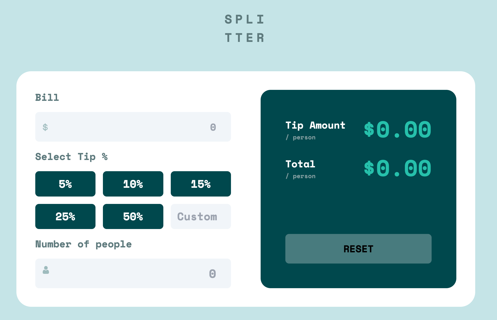
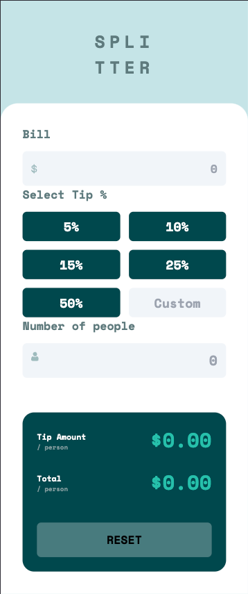

# Frontend Mentor - Tip Calculator Component Solution

## Overview of Challenge

### Users should be able to:

- View the optimal layout for the app depending on their device's screen size
- See hover states for all interactive elements on the page
- Calculate the correct tip and total cost of the bill per person

### Screenshot

 
Desktop View

 
Mobile View

### Links

[Vercel Deployed](https://bs-tip-calculator.vercel.app/)

### Built with

- React
- Vite
- JavaScript
- HTML
- Tailwind

### What I learned

- 

### Useful resources

- 

## Author

[Bobby Steckline](https://www.github.com/rsteckline)

This is a solution to the Tip Calculator component challenge on Frontend Mentor. [Source](https://www.frontendmentor.io/challenges/tip-calculator-app-ugJNGbJUX)